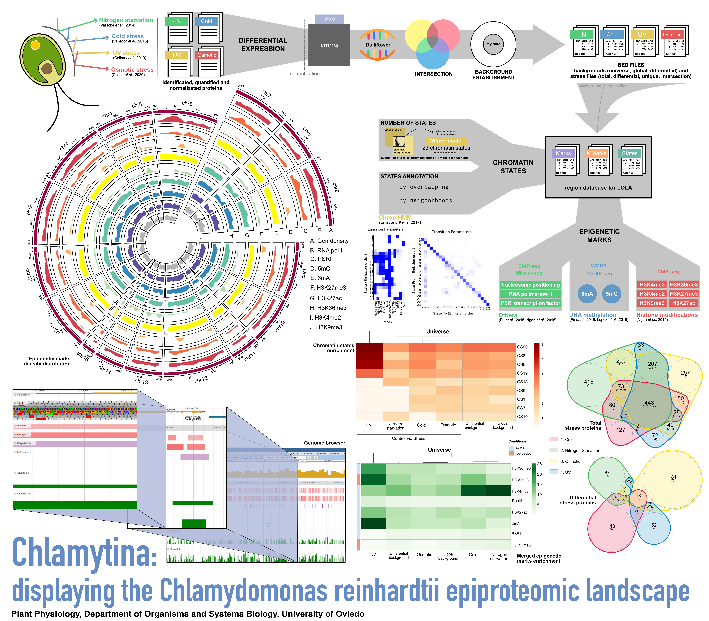

# Chlamytina

Chlamytina connects *Chlamydomonas reinhardtii* proteomic or transcriptomic changes with genomic and epigenomic annotations. It prepares gene/protein sets as BED files, runs differential analysis, builds biologically meaningful backgrounds, and tests overlap enrichment against curated Chlamydomonas epigenomic region databases.

<p align="center">
  
</p>

## Contents

0. [Purpose](#purpose)
1. [Installation](#installation)
2. [Inputs and Genome Versions](#inputs-and-genome-data)
3. [First Step: DataPrepare](#first-step-dataprepare)
4. [Second Step: LOLAEnrichments](#second-step-lolaenrichments)
5. [Outputs](#outputs)
6. [Genome Browser](#genome-browser)
7. [FAQ](#faq)

## 0. Purpose

Chlamytina was built around a practical question in Chlamydomonas proteomics and transcriptomics:

> Are my molecules of interest epigenetically regulated?

The project combines differential abundance/expression analysis, genomic coordinate conversion, BED export, curated epigenomic databases, and [LOLA](https://code.databio.org/LOLA/) overlap enrichment. The annotations include epigenetic marks, merged marks, published chromatin states, and the Chlamytina chromatin-state model integrating 5mC, 6mA, and MNase/nucleosome information.

## 1. Installation

### Recommended Conda Installation

Install [Conda](https://docs.conda.io/) first. Then clone the repository and run the installer from the repository root:

```bash
git clone https://github.com/RocesV/Chlamytina
cd Chlamytina
bash Code/0_ChlamytinaInstall.sh
```

The installer creates the `chlamytina` conda environment, installs the pinned R/Bioconductor stack, builds the local R conda packages used by Chlamytina, checks the script help, and runs bundled self-tests.

Activate the environment after installation:

```bash
conda activate chlamytina
```

> [!IMPORTANT]
> Run the installer from the repository root, not from inside `Code/` or another subdirectory.

> [!NOTE]
> The installation script removes any existing conda environment with the selected name before rebuilding it. By default that name is `chlamytina`. For a test installation, use:
>
> ```bash
> CHLAMYTINA_ENV_NAME=chlamytina_test bash Code/0_ChlamytinaInstall.sh
> ```

A successful reference installation can take up to ~ 10 minutes. The runtime depends on network speed, the state of conda cache, and machine performance.

The local R conda packages can take several minutes on the first run:

- `r-simplecache=0.5.0`
- `r-nvennr=0.2.3`
- `r-cowsay=1.2.2`

The installer keeps terminal output compact. Full logs are written under:

```bash
Code/.chlamytina-install-logs/
```

### Via Dockerhub (genome browser available)

Install Docker or Docker Desktop as follow https://docs.docker.com/ . This is the only way to get access to **genome browser**. Pull rocesv/chlamytina image from dockerhub

```bash
docker pull rocesv/chlamytina
```

Build the container using the image pulled. Because the [jbrowse](https://jbrowse.org/) inside the container is running in apache2 server, an empty port from the host (8080) need to be connected to container's 80 port. In order to share data between host and the container it is advisable to define a volume (-v) linking a host directory to /home/rocesv/Documents/Transfer folder.

```bash
docker run -t -i -d --name chlamytina_rocesv -p 8080:80 -v <ABSOLUTE PATH TO HOST SHARED DIRECTORY>:/home/rocesv/Documents/Transfer rocesv/chamytina bash
```

Check docker container is running

```bash
docker ps -a
```

Get inside the container

```bash
docker exec -i -t chlamytina_rocesv bash
```

Now you should see your container user like root@6a32e10fc951:/home#. Change directory to Chlamytina

```bash
cd Chlamytina/
```

Brief docker tutorial:

```bash
docker stop chlamytina_rocesv # Stop the container
docker start chlamytina_rocesv # Start the container
exit # Get outside the container
```

Using this via the time required for the following steps is minimum.

## 2. Inputs and Genome Versions

Input data should be a table where:

- The first column contains feature IDs.
- Each remaining column contains one biological sample protein abundance or trancript-/gene-level expression.
- Rows are proteins, transcripts, or genes.

Supported formats:

- `.xlsx`
- `.xls`
- tab-separated `.txt`

Chlamytina can work with protein-abundance tables, gene- or transcript-level expression tables, and transcriptomic count-like matrices. For transcriptomic workflows, count-scale values are preferred; these may include, for example, Salmon-derived estimates imported with tximport, including matrices generated with countsFromAbundance = "lengthScaledTPM". For count-like RNA-seq data, Chlamytina uses DESeq2, whereas limma provides greater flexibility for continuous or already transformed expression measurements, such as protein abundances or non-count expression metrics. Float values may be rounded only when they represent estimated counts.

> [!TIP]
> Check the test tables before preparing your own input:
>
> - `test/prots/`
> - `test/trans/`

Condition vectors describe the replicate layout. For example:

- `3-6` means two groups: first 3 samples versus next 6 samples.
- `3-3-3` means three groups: all pairwise contrasts are computed.

### Genome Versions

Chlamytina was originally developed around v5.6 annotation branch. v6.1 support is also available through versioned annotations, regionDB folders, and liftover-derived resources.

Use `-V` / `--version` to select the genome branch:

| Version argument | Annotation branch | Main files |
| --- | --- | --- |
| `-V v5` | v5.5/v5.6 | `Data/DB/v5/Creinhardtii_281_v5.5.gene_exons.gff3.gz`, `Data/DB/v5/Universe.bed`, `Data/DB/v5/ChlamydomonasTranscriptNameConversionBetweenReleases.Mch12b.txt` |
| `-V v6` | v6.1 | `Data/DB/v6/CreinhardtiiCC_4532_707_v6.1.gene_exons.gff3.gz`, `Data/DB/v6/Universe.bed` |

For v5, Chlamytina attempts ID conversion using the bundled conversion table. For v6, IDs are matched directly to the v6.1 annotation.

Versioned regionDB folders are available here:

```bash
Data/regionDB/Chlamytina_v5/
Data/regionDB/Chlamytina_v6/
```

### Whole-Genome Alignment and Git LFS

The whole-genome alignment file used for liftover support is provided in the repository through Git LFS:

```bash
Data/DB/liftover/Cr_3way.hal.gz
```

We thank the authors of the Chlamydomonas Genome Project v6 resource for kindly providing the whole-genome alignment file used for these liftovers. Reference: Craig et al., 2023, [The Plant Ce>

If you need the HAL file after cloning, install Git LFS and pull the object:

```bash
git lfs install
git lfs pull --include="Data/DB/liftover/Cr_3way.hal.gz"
```

> [!NOTE]
> Without Git LFS, this path may contain only a small pointer file instead of the real HAL object.

### RegionDB Collections

Available regionDB collections:

| Collection | Brief description |
| --- | --- |
| `Marks` | Individual epigenomic marks separated by original condition or experiment |
| `MMarks` | Merged epigenomic marks, useful for mark-level enrichment without condition-specific splitting |
| `CS_Control` | Published control chromatin states from Ngan et al. |
| `CS_N` | Published nitrogen-related chromatin states from Ngan et al. |
| `CS_S` | Published sulfur-related chromatin states from Ngan et al. |
| `CS_Chlamytina` | New Chlamytina chromatin states integrating 5mC, 6mA, and MNase/nucleosome information |

## 3. First Step: DataPrepare

`Code/1_DataPrepare.R` imports abundance/expression tables, optionally runs differential analysis, converts valid IDs to genomic coordinates, creates BED files, writes backgrounds for LOLA, and optionally creates expression/abundance-matched permutation sets.

Check help:

```bash
Rscript --vanilla Code/1_DataPrepare.R -h
```

```text
Usage: 1_DataPrepare.R [file] [condition] [file] [condition] ... [options]

Options:
	-A CHARACTER, --file1=CHARACTER
		Dataset1 file path. First column CreIDs. Other columns quantification data.

	-a CHARACTER, --condition1=CHARACTER
		Dataset1 Condition vector. It representes replicates for each treatment, separated by -
		Condition vector must contain all your replicates. For example (9 samples):
		1) 3-6 will set a contrast between the first three replicates and the last six
		2) 3-3-3 will set all possible two by two contrasts between the three treatments

	-B CHARACTER, --file2=CHARACTER
		Dataset2 file path

	-b CHARACTER, --condition2=CHARACTER
		Dataset2 Condition vector

	-C CHARACTER, --file3=CHARACTER
		Dataset3 file path

	-q CHARACTER, --condition3=CHARACTER
		Dataset3 Condition vector

	-D CHARACTER, --file4=CHARACTER
		Dataset4 file path

	-x CHARACTER, --condition4=CHARACTER
		Dataset4 Condition vector

	-E CHARACTER, --file5=CHARACTER
		Dataset5 file path

	-y CHARACTER, --condition5=CHARACTER
		Dataset5 Condition vector

	-d DIFFERENTIAL, --differential=DIFFERENTIAL
		If true, differential expression is performed [default = TRUE]

	-s SVA, --sva=SVA
		If true, sva removing unwanted variation is performed. Only for n>10-15 samples datasets. [default = FALSE]

	-i INTERSECT, --intersect=INTERSECT
		CreIDs intra-inter group specific discrimination [default = TRUE]

	-o CHARACTER, --out=CHARACTER
		Output directory [default = ./Outputs/]

	-g CHROMOSOME, --chromosome=CHROMOSOME
		If true, non-chromosome mapped proteins/genes are not taken into account [default = TRUE]

	-n CHARACTER, --normalization=CHARACTER
		Normalization metric used (limma-only). Options: normalizeQuantiles, none
		It is advisable to set this argument as none and preprocess the data when appropriate, for example, using pRocessomics [default = none]

	-m CHARACTER, --de_method=CHARACTER
		Differential expression method. Options: limma, DESeq2 [default = limma]

	-f CHARACTER, --diff_background=CHARACTER
		Differential background mode. Options: differential, permutations.
		permutations is useful when only one contrast is available [default = differential]

	-p INTEGER, --n_permutations=INTEGER
		Number of expression-matched permutation sets when --diff_background permutations [default = 500]

	-S INTEGER, --permutation_seed=INTEGER
		Random seed for permutation background generation [default = 123]

	-c INTEGER, --cores=INTEGER
		Number of cores for permutation background generation [default = 1]

	-V CHARACTER, --version=CHARACTER
		Genome annotation version. Options: v5, v6 [default = v5]

	-h, --help
		Show this help message and exit
```

### Differential Analysis

Chlamytina supports two differential methods:

- `limma`
- `DESeq2`

> [!WARNING]
> `normalizeQuantiles` is limma-only. Use `-n none` with `DESeq2`.

### Backgrounds Created by DataPrepare

Different backgrounds answer different enrichment questions.

| Background | Meaning | Typical use |
| --- | --- | --- |
| `Data/DB/v5/Universe.bed` or `Data/DB/v6/Universe.bed` | Whole annotation universe for the selected genome branch | Broad first-pass enrichment |
| `file1.bed`, `file2.bed`, etc. | All valid BED-exportable features from each input file | Experiment-specific measured background |
| `Global_background.bed` | Union of all valid input features across files | Multi-file global measured background |
| `Diff_background.bed` | Union of all differential features across contrasts | Differential universe when several contrasts exist |
| permutation BEDs | Matched random sets with similar expression/abundance to the query | One-contrast designs where `Diff_background.bed` is not informative |

`Diff_background.bed` and permutation BEDs are especially relevant when the goal is to detect epigenomic signatures associated with the user's data while reducing the influence of broad expression/abundance-linked epigenetic profiles.

> [!IMPORTANT]
> When only one differential contrast exists, `Diff_background.bed` is identical to the query set. In that case, prefer `file1.bed`, the genome `Universe.bed`, or `--diff_background permutations`.

### Permutation Backgrounds

Permutation backgrounds are useful when only one differential contrast is available. Chlamytina creates random sets with similar size and expression/abundance distribution to the query set.

This mode writes BED files under:

```bash
<output>/permutations/<contrast>/
```

Those permutation BEDs can then be passed to `Code/2_EnrichmentsLOLA.R` with `--permutation_path`.

Example:

```bash
Rscript --vanilla Code/1_DataPrepare.R \
  -A test/trans/Ge_DNMT1mtPlus_WTmtPlus_LengthScaledTPM.txt -a 2-2 \
  -d TRUE -m DESeq2 -n none \
  -f permutations -p 500 -S 123 -c 4 \
  -i TRUE -V v5 -g TRUE \
  -o tmp/out/transcriptomics_deseq2_perm
```

### Differential Contrast Limit

When `--intersect TRUE`, Chlamytina uses `nVennR` for Venn/intersection outputs.

If more than 10 differential contrast sets are detected, the Venn diagram step is skipped. Consider simplifying or redesigning the differential analysis to reduce the number of contrasts.

Skipped in that case:

- `diff_intersection.svg`
- `Diff_uniq_*.bed`

Still produced:

- individual contrast BED files
- `file*.bed`
- `Global_background.bed`
- `Diff_background.bed`
- differential result `.txt` tables

### Example Proteomics DataPrepare Run

```bash
Rscript --vanilla Code/1_DataPrepare.R \
  -A test/prots/protNitrogen.xlsx -a 4-20 \
  -B test/prots/protCold.xlsx -b 3-15 \
  -C test/prots/protOsmotic.xlsx -q 3-6 \
  -D test/prots/protUV.xlsx -x 3-6 \
  -d TRUE -m limma -n normalizeQuantiles -i TRUE -V v5 \
  -o tmp/out/proteomics_limma
```

## 4. Second Step: LOLAEnrichments

`Code/2_EnrichmentsLOLA.R` tests query BED files against a selected regionDB collection using LOLA. It writes result tables and heatmaps.

Check help:

```bash
Rscript --vanilla Code/2_EnrichmentsLOLA.R -h
```

```text
Usage: 2_EnrichmentsLOLA.R [file] [file] [file] [background] [database] ... [options]

Options:
	-A CHARACTER, --file1=CHARACTER
		First BED file path. Any BED file with chr, start and end or DataPrepare output

	-B CHARACTER, --file2=CHARACTER
		Second BED file path

	-C CHARACTER, --file3=CHARACTER
		Third BED file path

	-D CHARACTER, --file4=CHARACTER
		Fourth BED file path

	-E CHARACTER, --file5=CHARACTER
		Fifth file path

	-F CHARACTER, --file6=CHARACTER
		Sixth file path

	-G CHARACTER, --file7=CHARACTER
		Seventh file path

	-H CHARACTER, --file8=CHARACTER
		Eighth file path

	-I CHARACTER, --file9=CHARACTER
		Nineth file path

	-J CHARACTER, --file10=CHARACTER
		Tenth file path

	-b CHARACTER, --background=CHARACTER
		Background BED file path. The set of regions tested for enrichments

	-l LIST, --list=LIST
		If true, the rest of args are ignored and list all the files for one regionDB

	-o CHARACTER, --out=CHARACTER
		Output directory [default = ./Outputs/]

	-m CHARACTER, --significance_metric=CHARACTER
		Metric for target LOLA significance. Options: qValue, pValueLog [default = pValueLog]

	-t NUMERIC, --significance_threshold=NUMERIC
		Threshold for --significance_metric. Defaults: 0.05 for qValue; 1.30103 for pValueLog

	-p CHARACTER, --permutation_path=CHARACTER
		Folder with expression-matched permutation BEDs from 1_DataPrepare.R.
		Useful when only one contrast is available

	-e NUMERIC, --empirical_threshold=NUMERIC
		Empirical FDR threshold for permutation mode [default = 0.05]

	-r CHARACTER, --database=CHARACTER
		regionDB used. Options: Marks, MMarks, CS_Control, CS_N, CS_S, CS_Chlamytina [default = MMarks]

	-V CHARACTER, --version=CHARACTER
		Genome/regionDB version. Options: v5, v6 [default = v5]

	-c INTEGER, --cores=INTEGER
		Number of cores [default = 1]

	-h, --help
		Show this help message and exit
```

`2_EnrichmentsLOLA.R` accepts up to 10 query BED files, plus one background BED.

### Significance Metrics

Default target significance uses `pValueLog`:

```bash
-m pValueLog -t 1.30103
```

This corresponds to `-log10(0.05)`.

You can instead use q-values:

```bash
-m qValue -t 0.05
```

### Example Proteomics LOLA Run

```bash
Rscript --vanilla Code/2_EnrichmentsLOLA.R \
  -A tmp/out/proteomics_limma/Diff_uniq_file1Treatment2-Treatment1.bed \
  -B tmp/out/proteomics_limma/Diff_uniq_file2Treatment2-Treatment1.bed \
  -C tmp/out/proteomics_limma/Diff_uniq_file3Treatment2-Treatment1.bed \
  -D tmp/out/proteomics_limma/Diff_uniq_file4Treatment2-Treatment1.bed \
  -b tmp/out/proteomics_limma/Diff_background.bed \
  -r MMarks -V v5 -m pValueLog -c 4 \
  -o tmp/out/proteomics_limma_lola
```

### Example Transcriptomics LOLA Run with Permutations

```bash
Rscript --vanilla Code/2_EnrichmentsLOLA.R \
  -A tmp/out/transcriptomics_deseq2_perm/file1Treatment2-Treatment1.bed \
  -b tmp/out/transcriptomics_deseq2_perm/file1.bed \
  -p tmp/out/transcriptomics_deseq2_perm/permutations/file1Treatment2-Treatment1 \
  -r CS_Chlamytina -V v5 \
  -m pValueLog -t 1.30103 -e 0.05 -c 4 \
  -o tmp/out/transcriptomics_deseq2_perm_lola
```

## 5. Outputs

Chlamytina output depends on the selected options, but files fall into stable groups.

### From `1_DataPrepare.R`

| Output | Meaning |
| --- | --- |
| `file1Treatment2-Treatment1.txt` | Differential result table for one contrast |
| `file1Treatment2-Treatment1.bed` | BED query for one differential contrast |
| `file1.bed`, `file2.bed`, etc. | All valid BED-exportable features from each input table |
| `Global_background.bed` | Union of all valid input features across files |
| `Diff_background.bed` | Union of all differential features across contrasts |
| `Uniq_*.bed` | BED sets from whole-file intersections |
| `Diff_uniq_*.bed` | BED sets from differential-set intersections |
| `intersection.svg` | nVennR plot for whole-file intersections |
| `diff_intersection.svg` | nVennR plot for differential intersections |
| `permutations/<contrast>/Permutation_###.bed` | Expression/abundance-matched permutation BEDs |
| `permutations/<contrast>/permutation_index.txt` | Summary of permutation BED sizes |

`Diff_uniq_*.bed` files are not simply proteins unique to one input file. They are features uniquely differential in a specific contrast set after comparing differential sets across inputs or contrasts.

### From `2_EnrichmentsLOLA.R`

| Output | Meaning |
| --- | --- |
| `*<database>_LOLA_results.txt` | Full LOLA result table for the target query or queries |
| `*<database>_LOLA_permutation_results.txt` | Additional permutation-aware table when `--permutation_path` is used |
| `*<database>.pdf` | LOLA enrichment heatmap |

The permutation-aware table includes target significance and empirical permutation filtering columns, so the target LOLA result and the permutation-filtered interpretation can be inspected separately.

## 6. Genome Browser

Once you got into the docker container (2. Installation - Via Dockerhub) you need to start the apache2 server

```bash
service apache2 start
```

Now you can enjoy the genome browser at http://localhost:8080/jbrowse . The browser will be available while the container is running so as long as ```docker stop chlamytina_rocesv``` is not executed you can acces to jbrowse. We recommend to always select refseq track and one of the .Genes tracks (Nuclear, Mitochondrion, Chloroplast). The epigenomic tracks can be displayed by condition (Control, light ...) or merged (M-).

## 7. FAQ

### (Q) What type of inputs can I use?

Protein abundance, transcript-level expression, gene-level expression, or count-like transcriptomic matrices. The first column must contain feature IDs and the remaining columns must be samples.

### (Q) Which genome version should I use?

Use the genome version that matches your identifiers and biological question.

Chlamytina was originally built for the version 5 annotation branch, and v5 remains the most direct option for older Phytozome-style IDs because the repository includes a v5 conversion table.

Version 6.1 is also supported through the v6 annotation files, v6 regionDBs, and liftover-derived resources. The whole-genome alignment used for liftover support is available in the repository through Git LFS at:

```bash
Data/DB/liftover/Cr_3way.hal.gz
```

Use:

- `-V v5` for v5.5/v5.6-style identifiers or datasets that need the v5 conversion table.
- `-V v6` for v6.1 identifiers and v6.1 regionDBs.

### (Q) What is the permutation background niche?

Permutation background mode is mainly useful when only one differential contrast is available. With one contrast, `Diff_background.bed` is the same set as the query, so it is not informative as a LOLA background.

Permutation mode solves this by generating matched random sets with similar expression/abundance distribution and similar size to the query. LOLA is then run on the real query and on the matched sets, allowing enrichments to be filtered by target significance and empirical permutation behavior.

This is especially useful when trying to recover epigenomic signatures linked to the user's data without simply capturing broad expression/abundance-associated epigenetic profiles.

### (Q) Which background or universe should I use?

Use `Universe.bed` for a broad first-pass annotation background.

Use `file1.bed`, `file2.bed`, etc. when the measured feature space is restricted by the experiment or platform.

Use `Global_background.bed` when several input files define the measured universe together.

Use `Diff_background.bed` when several differential contrasts exist and you want the union of differential features as the enrichment universe.

Use permutation backgrounds when only one differential contrast exists and you want matched comparison sets.

### (Q) Why are there different regionDBs?

Different regionDBs test different biological layers:

- `Marks`: individual epigenomic marks separated by original condition or experiment.
- `MMarks`: merged epigenomic marks for condition-independent mark-level enrichment.
- `CS_Control`: published control chromatin states.
- `CS_N`: published nitrogen-related chromatin states.
- `CS_S`: published sulfur-related chromatin states.
- `CS_Chlamytina`: updated Chlamytina chromatin states with 5mC, 6mA, and MNase/nucleosome information.

For interpretation of `CS_Chlamytina`, see:

```bash
Data/DB/CS_Chlamytina_interpretation/
```

### (Q) How do I list the files inside one regionDB?

Use `--list TRUE` with the selected database and genome version:

```bash
Rscript --vanilla Code/2_EnrichmentsLOLA.R -l TRUE -r CS_Chlamytina -V v5
```

### (Q) What happens if many differential contrasts are generated?

Individual contrast BEDs and differential tables are still generated. Differential nVennR intersections are skipped above 10 contrast sets, so `diff_intersection.svg` and `Diff_uniq_*.bed` are not produced in that case.
